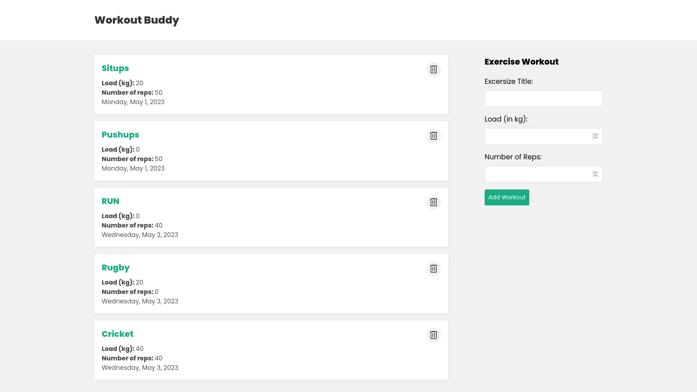

## Project Name: Workout Buddy 

Backend for a workout app that allows users to create and track daily workouts. 

Frontend repo can be found [here](https://github.com/jashezan/workout-buddy-frontend)

## Project Status

I have a few more features I'd like to add, but I'm ready to deploy this app and start using it.

## Project Screen Shot(s)
 



## Installation and Setup Instructions


Clone down this repository. You will need [`node`](https://nodejs.org/) and [`yarn`](https://yarnpkg.com/) installed globally on your machine.  

Installation:

```
yarn
```

To Start Server:

```
yarn start
```

To Visit App:

```
localhost:3000/
```
